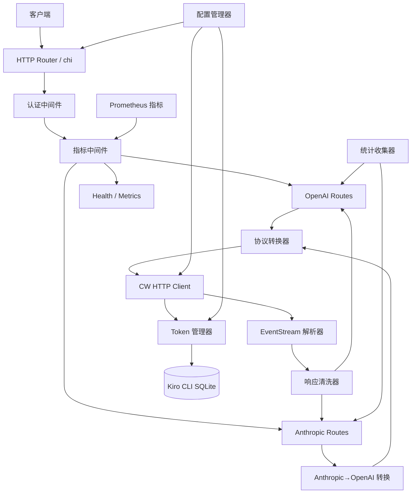
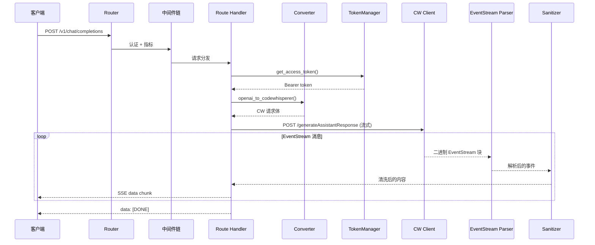
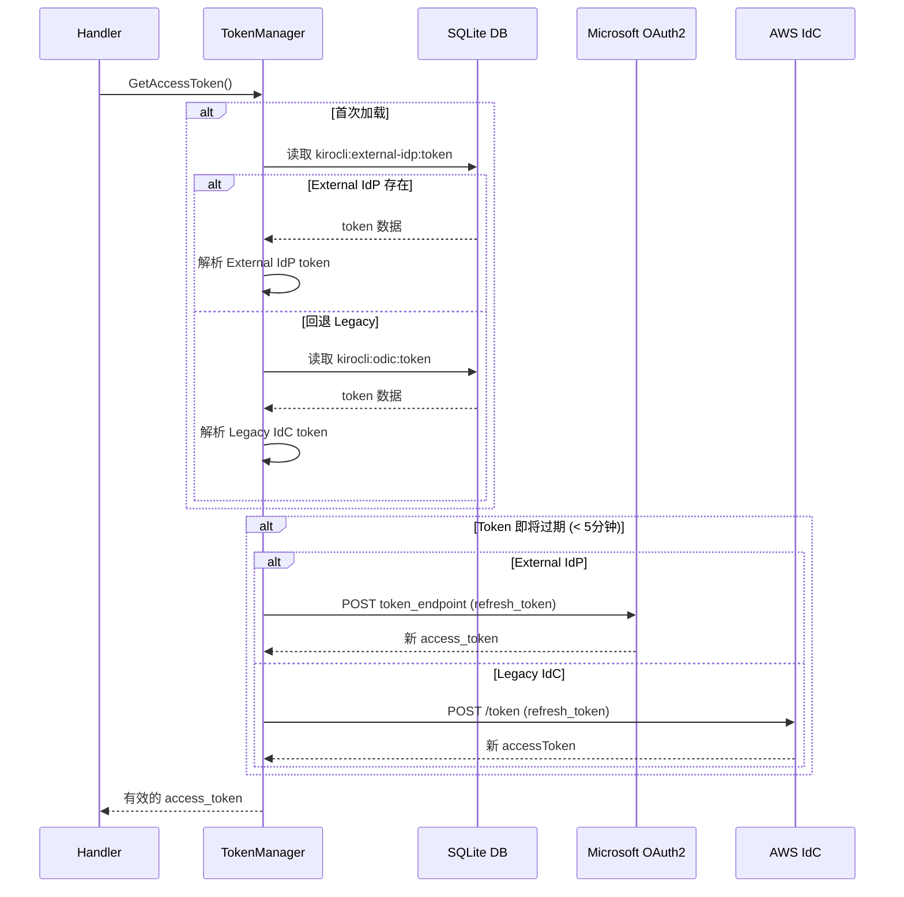

# 设计文档: Kiro Gateway Go 重写

## 概述

Kiro Gateway 是一个 API 网关，将 Kiro CLI 的 CodeWhisperer 后端封装为标准的 OpenAI 和 Anthropic 兼容 API 端点。本设计文档描述将现有 Python (FastAPI) 实现完整重写为 Golang 的技术方案。

Go 重写的核心目标：
- 功能完全对等：所有 Python 版本的功能必须 1:1 移植
- 性能提升：利用 Go 的并发模型和编译优势，降低延迟、减少内存占用
- 部署简化：单一静态二进制，无需 Python 运行时和依赖管理
- 可维护性：利用 Go 的强类型系统和接口抽象，提升代码质量

请求处理流程保持不变：客户端发送 OpenAI/Anthropic 格式请求 → 协议转换为 CodeWhisperer 格式 → 流式调用 CW 后端 → EventStream 解析 → 响应清洗 → 转换回客户端协议格式。

## 架构

### 整体架构

### 请求处理时序图

### Token 刷新时序图

